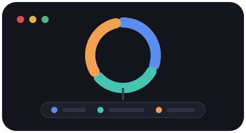

<p align="center">
  <picture>
    <source media="(prefers-color-scheme: dark)" srcset="assets/logo-dark.svg">
    
  </picture>
</p>

<h1 align="center">omniline</h1>
<p align="center"><em>One statusline framework. Every AI coding CLI.</em></p>

<p align="center">
  
  
  
</p>

A statusline framework for AI coding CLIs: shared rendering + data-lookup
primitives, plus one thin adapter per harness that maps that harness's own
JSON payload onto them — where the harness supports a custom command at all.

## Install

```bash
curl -fsSL https://raw.githubusercontent.com/Deetss/omniline/main/install.sh | bash
```

This downloads omniline into `~/.local/share/omniline` (override with
`--dir <path>` or the `$OMNILINE_HOME` env var), then hands off to its
interactive installer, which:

- detects which of Claude Code / antigravity-cli / Codex are on this machine
- shows any statusline each one already has configured
- asks before touching anything, and backs up whatever it's about to
  overwrite first — always, never silently

Safe to run again later: it updates the existing copy in place instead of
re-cloning, and re-running the installer just re-asks per harness.

Prefer to read a script before piping it into bash? Clone it and run the
same installer directly — `install.sh` does nothing `bin/install` doesn't:

```bash
git clone https://github.com/Deetss/omniline.git
cd omniline
python3 bin/install
```

Requires `python3` >= 3.8 and either `git` or `curl`+`tar`. No third-party
packages, nothing to compile.

## Why split it this way

Every one of these CLIs that supports a custom statusline invokes some
external command on every prompt render and feeds it a JSON blob on stdin,
but each has its own shape for the same concepts (model name, context usage,
rate limits, git branch...). Duplicating the whole statusline per harness
means the copies drift the moment one gets a feature the other doesn't —
which is exactly how this repo started (a Claude-Code-only bash script and a
half-finished Python rewrite silently diverged from each other, including a
"quota" schema someone had guessed at and gotten wrong). Adapters keep the
harness-specific mapping small and honest; everything else lives once.

## Per-harness support (confirmed, not assumed)

| Harness | Statusline hook | Adapter status |
|---|---|---|
| Claude Code | ✅ arbitrary shell command, JSON on stdin | Real, wired up |
| antigravity-cli | ✅ same shape as Claude Code | Real, verified against a live install |
| Codex | ❌ no custom command — fixed field list only | N/A — native config written directly |

**Claude Code** — `statusLine.command` in `settings.json`, JSON payload on
stdin. Fully wired up.

**antigravity-cli** — same shape as Claude Code (`statusLine.command` in
`settings.json`, or `/statusline <path>`). Originally built from the
documented schema alone; now verified against a real install and real
payload, quota bucket rendering included.

**Codex** — no way to execute a script. Confirmed against Codex's own source
(`codex-rs/tui/src/bottom_pane/status_line_setup.rs`): only a fixed,
kebab-case identifier list under `[tui]`/`status_line` in
`~/.codex/config.toml`. Tracked upstream:
[openai/codex#17827](https://github.com/openai/codex/issues/17827). Not an
adapter — `bin/install` writes that native config directly instead.

## Layout

```
omniline/
  render.py        ANSI colors, bar meters, pct->color. Pure functions.
  pace.py           Burn-aware coloring for rate-limit windows (usage vs.
                    time elapsed in the window, not just absolute %).
  sources/          Reusable lookups: clauth account, git branch, edgentic
                    local-token log. Any adapter can call these.
  adapters/         One module per harness with a real custom-command hook.
    claude_code.py  Real, wired-up implementation.
    antigravity.py  Real implementation, verified against a live
                    antigravity-cli install.
    codex.py        Permanent no-op. See table above — there's nothing to
                    wire this to; it exists only so bin/codex-statusline
                    fails safe instead of crashing if ever invoked.
  installer.py      Detects installed harnesses + existing statusline
                    config, backs up before touching anything, then
                    installs / uninstalls / restores per harness. Every
                    path in it goes through home_dir(), which honors
                    OMNILINE_TEST_HOME so tests never touch a real
                    config file.
bin/
  claude-statusline       python3 bin/claude-statusline
  antigravity-statusline  python3 bin/antigravity-statusline
  codex-statusline        Always a no-op — see table above
  install                 Interactive setup: python3 bin/install
  uninstall               Interactive removal: python3 bin/uninstall
  restore                 Interactive restore from a backup: python3 bin/restore
install.sh              curl | bash bootstrapper — fetches the repo, then
                        runs bin/install. See Install above.
tests/
  test_installer.py  Exercises install -> backup -> uninstall -> restore
                    for every harness against a fake $HOME. Run with
                    `python3 -m pytest tests/`.
```

## Uninstall / restore

```bash
python3 bin/uninstall   # back up current state, remove this framework's config
python3 bin/restore     # pick a backup for a harness, back up current state, restore it
```

Backups live at `backups/<harness>-<original filename>.<timestamp>.bak`
(gitignored — machine-local, not something to commit). The harness prefix
matters: Claude Code's and antigravity-cli's config are both literally named
`settings.json`, so without it their backups would be indistinguishable.

## Adding a harness

1. Confirm the harness actually supports executing a custom command with
   JSON on stdin — check its own docs/source, don't assume. If it only
   supports fixed built-in fields (like Codex), it needs `install_*` /
   `uninstall_*` functions in `installer.py` instead of an adapter.
2. Capture a real payload sample if you can. Don't guess at field names —
   see `adapters/antigravity.py`'s docstring for what an earlier guess
   (wrong key names, entirely fictional shape) cost this repo once already.
3. Write `omniline/adapters/<harness>.py`: read the payload with
   `base.read_payload()`, pull out whatever fields exist, build up a `parts`
   list using `render.meter()` / `pace.pace_color()` / `sources.*`, print
   `render.join_segments(parts)`. Only render a segment when the data for it
   is actually present — a harness that doesn't send rate limits should
   just not show a rate-limit segment, not crash or show zeros.
4. Add `bin/<harness>-statusline` (copy `bin/claude-statusline`, swap the
   import).
5. Add status/install/uninstall functions to `installer.py`, using
   `home_dir()` for every path (not `os.path.expanduser` directly) so it
   stays testable, and register it in `COMMAND_HARNESSES` (or alongside
   Codex's handling in `main()`/`uninstall_main()` if it's a fixed-identifier
   harness rather than a custom command).
6. Add its install/uninstall/restore cases to `tests/test_installer.py`.

## Wiring

Claude Code: `~/.claude/settings.json` → `statusLine.command` →
`~/.claude/statusline-command.sh` (a one-line `exec` into
`bin/claude-statusline`, so Claude Code's settings never need to know this
repo moved). `bin/install` points fresh installs straight at `bin/claude-statusline`
instead of adding another shim layer — the shim above predates the installer.

antigravity-cli: `~/.gemini/antigravity-cli/settings.json` → `statusLine.command`
→ `bin/antigravity-statusline` directly.

## Testing

```bash
python3 -m pytest tests/
```

To try a single adapter change by hand:

```bash
echo '{"cwd":"'"$PWD"'","model":{"display_name":"Sonnet 5"},"context_window":{"used_percentage":34}}' \
  | python3 bin/claude-statusline
```
